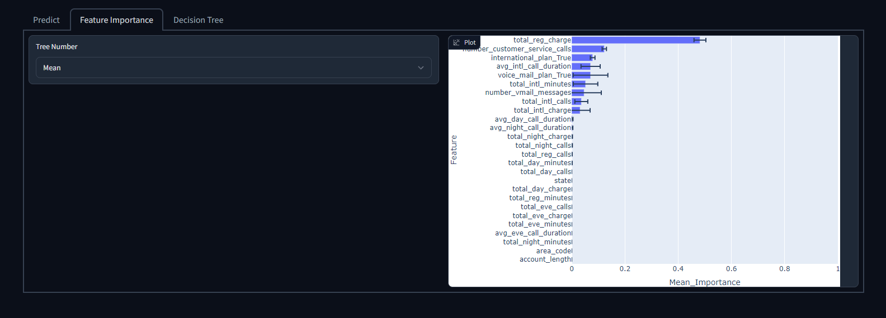

# Customer Churn Prediction

## Description
This project is based on the "Customer Churn Prediction 2020" Kaggle challenge and aims to solve the challange but also build an deployable MVP. This MVP includes a separated frontend and backend which are implemented following the microservice architecture and can be run with docker compose.

## Installation
1. Install docker
2. Install docker compose

## Usage
1. Check out the exploratory data analysis (eda.ipynb)
2. Start the project with ```docker compose up```.
3. Reach the frontend under http://localhost:7860 and the backend under http://localhost:8000/docs.

## Example
### Predict Customer Churn


### Understand Customer Churn


### Visualize Machine Learning Model
